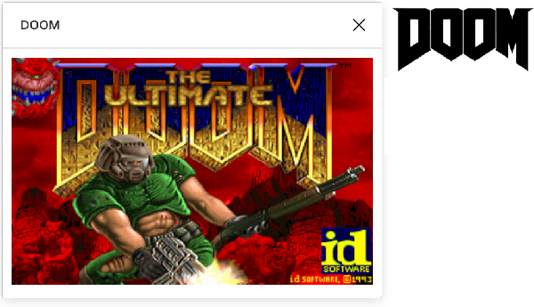

# DOOM plugin for Figma

I have been wanting to do a [Figma](https://figma.com) plugin since the support for it was announced, and since i like the product so much, so when i saw that [someone tweeted](https://twitter.com/jonathontoon/status/1192713497991245824) `How soon until someone ports original DOOM to Figma` it felt like the right combination of useless, stupid and interesting enough.




## How does it work

So i looked for a WebAssembly doom port and found [this one](https://github.com/lazarv/wasm-doom) tried to build it, had to [patch a couple of things](doom/patch.diff) because i was using a more recent version of Emscripten.

I tried running webassembly directly in the plugin but thanks to the security boundaries in Figma the plugin was unable to fetch the data needed, so i had to resort to an `<IFRAME>` instead and host the actual game somewhere else.


## Using it

Download this and unpack it somewhere, select "Link existing plugin" in the "Create plugin" dialog, then select the `plugin/manifest.json` file.


## Building it yourself

The plugin itself is very simple, it is just an iframe, to change where it loads the game from, change the server URL in [code.js](plugin/code.js) in the `plugin` folder.

The server part needs to be hosted on HTTPS, so either deploy it somewhere or just use `ngrok` or a similar service to tunnel your local machine.

The WebAssembly Doom port itself requires Emscripten to build, you also need to [download the shareware IWAD file](https://www.doomworld.com/classicdoom/info/shareware.php).

I had to patch a few things to make it build, they're in the `doom/patch.diff` file, apply them like this `patch -p1 < path/to/doom/patch.diff`

After bootstrapping Emscripten you can use cmake to build it.

```
mkdir build
cd build
emconfigure cmake -DCMAKE_BUILD_TYPE=RelWithDebInfo ..
```

This will produce a `doom.js`, `doom.wasm`, `doom.data` and a `doom.html` - put all but the html file into the `server` folder


## Acknowledgements

DOOM&reg; is a registered trademark of ZeniMax Media Inc. in the US and/or other countries. Id Software® is a registered trademark of ZeniMax Media Inc. in the US and/or other countries.

I'm unfortunately in no way affiliated with any of them.
